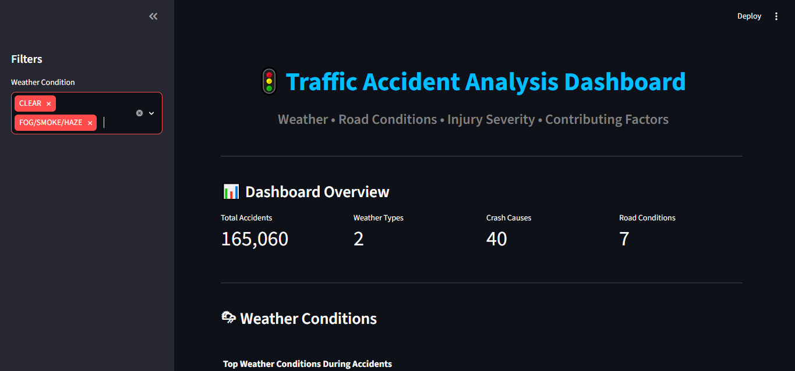
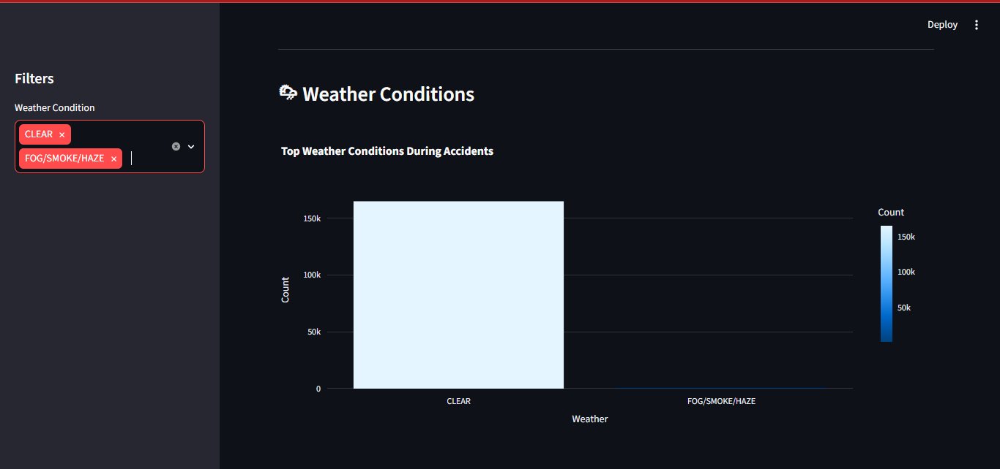
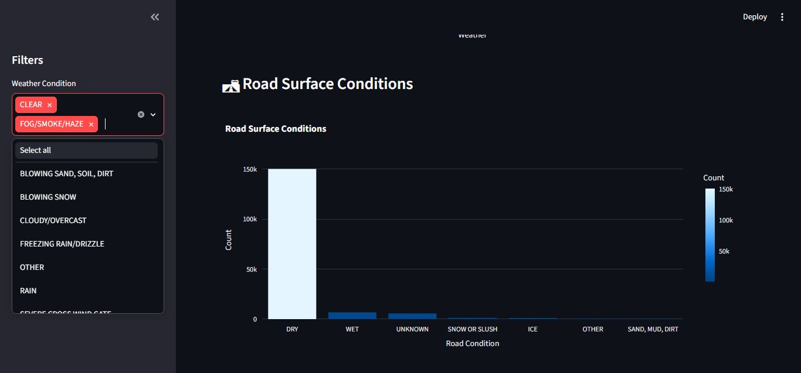
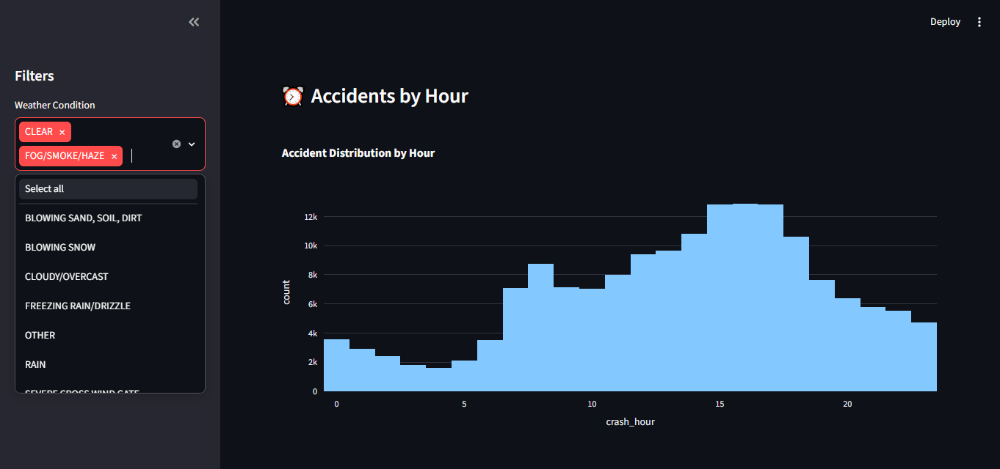
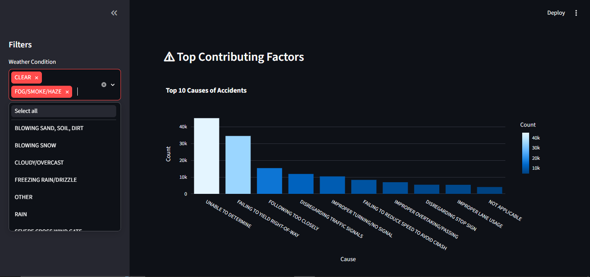

# 🚦 Traffic Accident Analysis Dashboard

## 📌 Prodigy InfoTech Internship - Task 05

This project analyzes traffic accident data to identify patterns related to weather conditions, road conditions, time of day, and contributing factors. An interactive dashboard was developed using Streamlit to visualize accident trends and provide meaningful insights.

---

# 📖 Project Overview

Traffic accidents are influenced by multiple environmental and human factors. This project performs Exploratory Data Analysis (EDA) on a traffic accident dataset and presents interactive visualizations to better understand accident trends.

The dashboard allows users to filter accidents by weather conditions and explore different accident characteristics using dynamic charts.

---

# 🎯 Objectives

- Analyze accident frequency under different weather conditions.
- Study road surface conditions associated with accidents.
- Identify accident trends by hour of the day.
- Determine the leading contributing causes of accidents.
- Visualize injury severity distribution.
- Build an interactive Streamlit dashboard for data exploration.

---

# 🛠️ Technologies Used

- Python
- Pandas
- NumPy
- Plotly Express
- Streamlit
- Google Colab
- VS Code

---

## Dataset

The dataset is too large to upload to GitHub.

Download it from the original source and place it in the project folder before running the application.

Filename:

traffic_accidents.csv


# 📂 Dataset

Traffic Accident Dataset

Features used:

- Weather Condition
- Road Surface Condition
- Crash Hour
- Crash Day of Week
- Crash Month
- Crash Type
- Primary Contributory Cause
- Most Severe Injury

---

# 📊 Dashboard Features

✔ Interactive Weather Filter

✔ KPI Cards

- Total Accidents
- Weather Types
- Crash Causes
- Road Conditions

✔ Weather Condition Analysis

✔ Road Surface Condition Analysis

✔ Accident Distribution by Hour

✔ Monthly Accident Analysis

✔ Top Contributing Factors

✔ Injury Severity Distribution

✔ Download Filtered Dataset

✔ Dataset Preview

---

# 📷 Dashboard Screenshots

## Dashboard Overview



---

## Weather Condition Analysis



---

## Road Surface Condition Analysis



---

## Accident Distribution by Hour



---

## Top Contributing Factors



---

# 🚀 How to Run

Clone the repository

```bash
git clone https://github.com/yourusername/PRODIGY_DS_05.git
```

Move into the project

```bash
cd PRODIGY_DS_05
```

Install dependencies

```bash
pip install -r requirements.txt
```

Run Streamlit

```bash
streamlit run app.py
```

---

# 📈 Key Insights

- Most accidents occur during clear weather conditions.
- Dry roads account for the highest number of accidents.
- Accident frequency increases during afternoon and evening hours.
- Driver-related factors are the leading contributors to accidents.
- Most reported accidents involve non-fatal injuries.

---

# 📁 Project Structure

```
PRODIGY_DS_05/
│
├── app.py
├── requirements.txt
├── README.md
├── traffic_accidents.csv
├── Traffic_Accident_Analysis.ipynb
│
└── screenshots/
    ├── dashboard.png
    ├── weather_analysis.png
    ├── road_conditions.png
    ├── accidents_by_hour.png
    └── top_contributing_factors.png
```

---

# 👩‍💻 Author

**Prathama Debnath**

B.Tech CSE (AI & ML)

SRM Institute of Science and Technology

---

# ⭐ Internship Task

**Prodigy InfoTech Data Science Internship**

**Task 05**

Analyze traffic accident data to identify patterns related to road conditions, weather, and time of day. Visualize accident hotspots and contributing factors.
